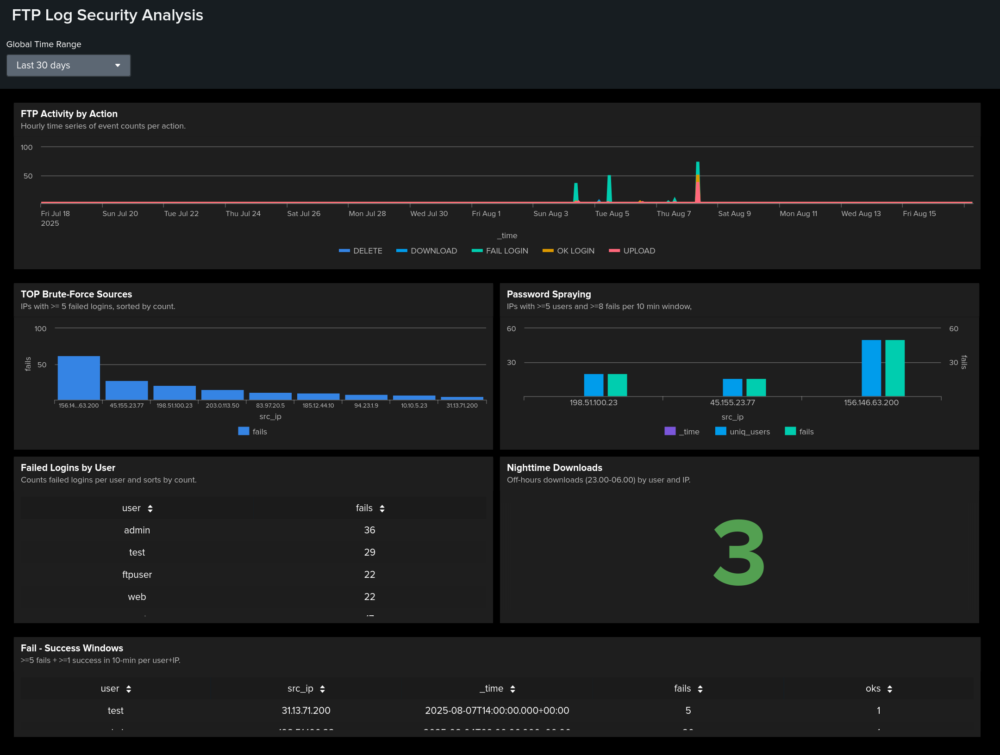

# FTP Log Security Analysis in Splunk

Analytical FTP security case: detection of brute-force, password spraying, compromise windows, and risky transfers. The project relies on six focused SPL searches and a dashboard.

## Demo

- **Dashboard (screenshot):**

- **Full report (DOCX):** [FTP_logs_report.docx](./FTP_logs_report.docx) — step-by-step searches, screenshots, observations, and conclusions.  
- **Dashboard file:** [FTP_dashboard.png](./FTP_dashboard.png)   — import into Splunk (Studio/SimpleXML).

## Data

- **Source:** `index=main`, `sourcetype=ftp_logs`  
- **Parsed fields:** `user`, `action` (`FAIL LOGIN` | `OK LOGIN` | `UPLOAD` | `DOWNLOAD` | `DELETE`), `src_ip`, optional `path`, `bytes`, `rate`  
- **Time:** `_time` (from FTP log)

## Performed Checks and Conclusions

### 1) Baseline sample (first 20 events)
- **Purpose:** verify parsing.  
- **Finding:** `user`/`action`/`src_ip` extract reliably; file ops provide `path`/`bytes`.  
- **Recommendation:** lock parsing in `props.conf`, align to CIM.

### 2) Top brute-force sources (by IP)
- **Purpose:** find sources with many failed logins.  
- **Finding:** several IPs generate dozens of `FAIL LOGIN`.  
- **Recommendation:** rate-limit/ban by IP, enable MFA where possible.

### 3) Failed logins by user
- **Purpose:** see which users are targeted most.  
- **Finding:** priority targets: admin and service accounts.  
- **Recommendation:** strengthen password policy, disable unused accounts.

### 4) Fail → Success windows (10-minute windows)
- **Purpose:** capture compromise after a series of failures.  
- **Finding:** windows with ≥5 `FAIL` and ≥1 `OK` from one IP to one user.  
- **Recommendation:** host forensics, password reset, check adjacent services.

### 5) Password spraying (multi-user from one IP)
- **Purpose:** detect cross-user password attempts.  
- **Finding:** a single IP hits ≥5 different users within a short window.  
- **Recommendation:** template alerts, block the source, user awareness.

### 6) Nighttime downloads (23:00–06:00)
- **Purpose:** find possible off-hours exfiltration.  
- **Finding:** rare but notable nighttime downloads.  
- **Recommendation:** volume- and time-based alerts; cross-check schedules.

## Analysis
- Baseline view of FTP activity by actions and sources.  
- Attack patterns captured: brute-force, spraying, and fail→success.  
- Transfer risks highlighted in off-hours. Panels provide quick entry points for investigations and alerts.

## Conclusion
Repeatable workflow for threat hunting in FTP logs: 6 targeted searches plus a dashboard provide visibility into attacks and suspicious transfers, with practical recommendations. Full steps, screenshots, and findings are in **FTP_logs_report.docx**; the dashboard is **FTP_dashboard**.

## About
FTP log analysis for InfoSec in Splunk: 6 SPL searches, a dashboard, and a DOCX report.
